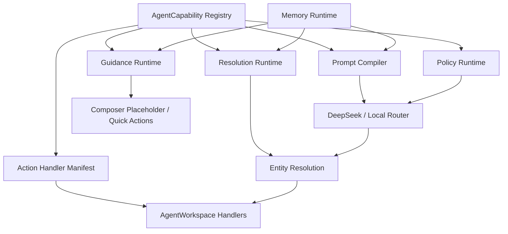

# Pislaka Agent 可配置能力架构

## 目标

这份文档说明 Agent 能力、引导、确认策略、实体解析和前端动作处理如何配置化。后续新增或修改 Agent 能力时，应优先修改 registry/runtime，而不是把规则继续写进 `AgentWorkspace.tsx` 或 prompt 字符串里。

核心目标：

- 固定业务场景下，Agent 不做开放式闲聊发散，而是把用户推进到明确业务流程。
- 能力、提示、确认边界和实体解析策略集中在配置层，便于维护和回归测试。
- 记忆必须分层、标注可信度和使用边界；聊天上下文只能辅助判断，数据库才是业务事实来源。
- LLM 输出只是 action proposal；真正的安全边界由 typed runtime 和数据库解析负责。

## 中台扩展口

这套架构应作为 AI 产品中台的模板，而不是只服务经纪人 Agent。长期形态是：

```text
同一套 Agent Runtime
  + 不同 Capability Registry
  + 不同 Guidance 策略
  + 不同 UI Card / Handler
  + 不同数据权限和业务对象
= 不同垂直 AI 产品
```

当前 registry 已为这个方向预留：

```ts
product: {
  productScopes: ["broker_agent"],
  actorTypes: ["broker"]
}
```

未来可扩展为：

- `buyer_advisor`：面向国内购房者的选房师。
- `developer_agent`：面向开发商的项目、库存、渠道和销售线索助手。
- `internal_ops`：面向内部运营、内容审核、数据质量和客户成功团队。

## 架构分层



## 关键文件

| 层 | 文件 | 作用 |
| --- | --- | --- |
| Capability Registry | `lib/agent/registry/intents.ts` | 每个 intent 的业务域、输入、路由、确认、风险、实体解析、UI、引导和 prompt metadata |
| Memory Runtime | `lib/agent/memory.ts` | 把短期聊天、workflow state、当前选中实体、附件和运行时上下文编译成带可信度/生命周期/使用边界的 memory context |
| Prompt Compiler | `lib/agent/registry/prompt.ts` | 从 registry 编译 supported intents、routing rules、workflow rules、resolution rules |
| Guidance Runtime | `lib/agent/guidance.ts` | 根据 broker/workspace 状态生成首页快捷动作、placeholder、下一步建议 |
| Policy Runtime | `lib/agent/confirmation-policy.ts` | 从 registry 计算 `requires_confirmation`、risk、audit、uiCard、requiresAuthForWrite |
| Resolution Runtime | `lib/agent/entity-resolution.ts` | 按 registry 的 `allowCurrentContext` 和 `allowLatestOnlyWhenExplicit` 解析 lead/listing/schedule |
| Resolution UI Contract | `components/agent/agent-resolution-ui.ts` | 把 no_match、ambiguous、needs_clarification 统一成标准 message/actions/candidates |
| Router | `lib/agent/deepseek.ts` | LLM/local fallback 输出 `AgentAction`，最终统一应用 policy |
| Handler Manifest | `components/agent/agent-action-response-handlers.ts` | intent 到前端 handler 的映射，同时暴露 policy manifest |
| Workspace Shell | `components/agent/AgentWorkspace.tsx` | 负责 UI state、消息流、卡片渲染；不应继续承载业务规则 |

## Capability Registry 字段

每个 intent 必须在 `agentIntentRegistry` 中声明：

```ts
{
  intent: "create_campaign_links",
  product: {
    productScopes: ["broker_agent"],
    actorTypes: ["broker"]
  },
  domain: "content_generation",
  requiredEntities: ["listing"],
  confirmation: "always",
  supportedChannels: ["whatsapp", "facebook", "instagram", "portal"],
  uiCard: "promotion_pack",
  audit: "trace_confirm_and_write",
  availability: {
    guest: true,
    broker: true,
    requiresAuthForWrite: true
  },
  input: {
    requiredSlots: ["listing_target"],
    optionalSlots: ["channels", "audience", "tone"],
    examples: ["Promote my DHA 5 villa on WhatsApp"]
  },
  routing: {
    priority: 85,
    triggerPhrases: ["promote", "campaign links"],
    negativeExamples: ["Reply to Ahmed on WhatsApp"],
    channelBehavior: "parameter",
    promptRule: "..."
  },
  policy: {
    risk: "external"
  },
  resolution: {
    allowCurrentContext: true,
    allowLatestOnlyWhenExplicit: true
  },
  ui: {
    emptyStateLabel: "Create Promo Post",
    actionLabel: "Promote listing",
    placeholder: "Choose a property and channel..."
  },
  guidance: {
    proactiveTriggers: ["listing_created_not_promoted"],
    nextSteps: ["list_leads", "show_basic_attribution"]
  },
  prompt: {
    workflowRules: ["Trackable links require a confirmed saved asset or listing target."]
  }
}
```

## 业务安全边界

### Confirmation

`confirmation` 决定 action proposal 是否需要用户确认：

- `never`：只读、聊天内草稿、分析总结、preview 生成。
- `always`：写入、状态更新、日程创建/修改、推广链接、外部动作。
- `conditional`：由 payload 决定，例如 `record_lead_followup` 中 `message_sent` 可由明确 Sent 动作触发，状态变化仍需确认。

最终口径在 `applyAgentActionPolicy()` 中统一覆盖 `requires_confirmation`。即使 local parser 或 LLM 返回了旧值，最终也会按 registry policy 修正。

### Entity Resolution

实体解析必须遵守 registry resolution policy：

- `allowCurrentContext: true`：允许使用已选择/已附加实体；只有当用户说 `this/current/selected/attached/刚才` 等指代词时，才可使用 `currentLeadId/currentListingId`。
- `allowLatestOnlyWhenExplicit: true`：只有用户明确说 `latest/most recent/newest/最新` 时，才可使用最新 listing。
- `allowCurrentContext: false`：不得自动使用当前上下文。

禁止行为：

- 找不到 Ahmed 时拿最新 lead 顶上。
- 找不到目标 listing 时拿最近 listing 顶上。
- 因为出现 WhatsApp/Facebook 渠道词就跳过 lead/listing 解析。
- ambiguous 时静默选择分数最高的候选。

## Resolution UI Contract

`components/agent/agent-resolution-ui.ts` 统一 `no_match`、`ambiguous`、`needs_clarification` 三类失败状态的展示 contract：

```ts
{
  status: "no_match" | "ambiguous" | "needs_clarification",
  message: {
    headline: "Couldn't find this lead",
    detail: "No saved lead matches \"Ahmed\". Check the buyer name or phone number."
  },
  actions: [
    { label: "Show recent leads", type: "fallback_list" },
    { label: "Try again", type: "retry_input" }
  ],
  candidates: [
    {
      id: "...",
      displayLabel: "Ahmed Raza · +92 300... · DHA Villa"
    }
  ]
}
```

使用原则：

- `no_match`：说明找不到哪个对象，并给出 fallback/retry 动作，不允许静默展示最新记录。
- `ambiguous`：必须暂停流程，展示候选，让经纪人选择；所有 intent 复用同一候选 copy 结构。
- `needs_clarification`：说明缺哪类信息，引导补充细节，而不是强行猜目标。
- 前端可以继续用现有卡片渲染，但文案和候选 label 应来自 contract，避免每个 handler 各写一套提示。

## Memory Runtime

`lib/agent/memory.ts` 负责把分散上下文收敛成统一的 `AgentMemoryRuntimeContext`。它不是“让模型随便记住一切”，而是给每类记忆声明：

- `source`：来自 chat、database、explicit_selection、context_attachment、location_normalization 还是 runtime。
- `trustLevel`：`reference_only`、`confirmed`、`source_of_truth`。
- `allowedUse`：可用于 routing、guidance、prompt、entity_resolution 中的哪些环节。
- `expires`：turn、session、conversation、permanent。

当前第一版 memory 分层：

```ts
{
  shortTerm: {
    messages: [
      {
        source: "chat",
        trustLevel: "reference_only",
        allowedUse: ["routing", "guidance", "prompt"],
        expires: "conversation"
      }
    ]
  },
  workflow: {
    stage: "awaiting_confirmation",
    activeIntent: "create_campaign_links",
    awaiting: "confirmation",
    pendingSlots: [],
    relatedEntities: [
      {
        type: "listing",
        entity_id: "..."
      }
    ],
    source: "runtime",
    trustLevel: "confirmed",
    allowedUse: ["routing", "guidance", "prompt"],
    expires: "conversation"
  },
  workspace: {
    currentLead: {
      source: "explicit_selection",
      trustLevel: "confirmed",
      allowedUse: ["routing", "guidance", "prompt", "entity_resolution"],
      expires: "turn"
    },
    attachments: [
      {
        source: "context_attachment",
        trustLevel: "confirmed",
        expires: "turn"
      }
    ]
  }
}
```

使用原则：

- 聊天记忆可以帮助判断“那套房”“刚才那个客户”“继续发一下”这类多轮意图，但不能当作已保存的业务事实。
- Workflow state 是过程记忆，用来描述当前任务处于 `collecting_info`、`awaiting_confirmation`、`needs_selection`、`completed` 哪一步。
- Workflow state 可以帮助 Agent 解释短句，例如“确认”“继续”“那就发一下”，也可以帮助生成下一步问题；但不能跳过 confirmation、entity resolution 或数据库事实校验。
- Workflow state 可以携带 `relatedEntities`，说明当前确认/选择/补信息关联哪个 lead/listing；这些引用仍需遵守 entity resolution 和 confirmation policy。
- 用户明确发起新的业务意图时，应允许打断当前 workflow，例如正在等待推广确认时，`Update lead Ahmed phone...` 应进入 `update_lead_details`，而不是被强行解释成推广确认。
- Workflow state 优先来自前端当前消息列表推导的 `workflow_state`；如果没有，后端可从最近 assistant 消息的 `structured_payload.ui` 保守推导。
- 当前选中实体和附件可以帮助 routing/guidance/entity resolution，但具体能否使用仍要服从 registry 的 `resolution.allowCurrentContext`。
- `workspace.currentLead/currentListing` 是 turn-level context：每一轮都必须由当前 UI/URL/明确附件重新提供；如果下一轮没有 active selection，Memory Runtime 不会保留上一轮的 lead/listing。
- 当前上下文必须跟随“最后一次明确选中”替换，不允许把很久以前选中的客户/房源当成默认目标。
- lead、listing、schedule、campaign、follow-up 等长期事实必须来自 PostgreSQL 业务表。
- 后续扩展 buyer advisor / developer agent 时，应先定义该产品的 memory source、trustLevel 和 allowedUse，而不是直接复用 broker agent 的记忆规则。

### Channels

渠道永远是参数，不是 intent：

- `Reply to Ahmed on WhatsApp` -> `draft_lead_reply`，channel=`whatsapp`。
- `Promote this listing on WhatsApp` -> `create_campaign_links`，channel=`whatsapp`。
- `Write Facebook copy for this villa` -> `generate_social_copy`，channel=`facebook`。

## Guidance Runtime

`lib/agent/guidance.ts` 把 broker/workspace 状态转成引导：

- 首页 quick actions。
- Composer placeholder。
- 完成一个 intent 后的 next step。
- WhatsApp import 或 active lead/listing 场景下的 contextual prompt。

原则：

- 快捷操作不是静态菜单，而是最可能的下一步。
- Placeholder 不应是通用空话，应基于当前上下文。
- 引导不直接执行写入，只生成 prompt/action proposal。

## Frontend Adapter 层

`AgentWorkspace.tsx` 现在应逐步保持为 shell：

- 管理 React state、消息列表、输入框、卡片。
- 调用 runtime/helper。
- 调用具体 API。

已拆出的 adapter/helper：

- `components/agent/agent-guidance-actions.ts`
- `components/agent/agent-composer-attachments.ts`
- `components/agent/agent-composer-context.ts`
- `components/agent/agent-composer-files.ts`
- `components/agent/agent-submit-context.ts`
- `components/agent/agent-submit-workflow.ts`
- `components/agent/agent-whatsapp-import-turn.ts`
- `components/agent/agent-action-response-handlers.ts`
- `lib/agent/memory.ts`

新增逻辑时优先放入这些 helper，或者新增同级 helper；不要把新的业务规则直接塞回 `AgentWorkspace.tsx`。

## 新增 Intent 的步骤

1. 在 `lib/agent/types.ts` 的 `agentActionSchema.intent` 中加入 intent。
2. 在 `lib/agent/registry/intents.ts` 中补完整 capability definition，并明确 `product.productScopes` 和 `product.actorTypes`。
3. 如果 LLM 可直接返回该 intent，确认 `routing.exposeToLlm` 没有设为 `false`。
4. 在 `lib/agent/registry/prompt.ts` 的测试中确认 prompt 能编译出规则。
5. 如果需要实体解析，在 `lib/agent/entity-resolution.ts` 中接入 typed payload 和 registry resolution policy。
6. 如果 intent 需要多轮上下文，在 `lib/agent/memory.ts` 中确认对应 memory source、trustLevel、allowedUse、expires。
7. 如果需要前端卡片，在 `components/agent/agent-action-response-handlers.ts` 中增加 handler spec。
8. 如果需要首页或上下文引导，补 `guidance.proactiveTriggers`、`guidance.nextSteps`、`ui.placeholder`、`ui.actionLabel`。
9. 增加代表性测试：
   - registry invariant。
   - prompt compiler。
   - confirmation policy。
   - entity resolution。
   - action handler。
   - 必要时加 routing/local fallback 测试。

## 修改现有 Intent 的检查清单

修改任何 intent 时，必须检查：

- `product.productScopes` 和 `product.actorTypes` 是否符合目标产品，不要默认所有能力都属于所有产品。
- `confirmation` 是否和 `policy.risk` 一致。
- `audit` 是否和风险一致，write/external 通常应为 `trace_confirm_and_write`。
- `requiredEntities` 是否和 entity-resolution 行为一致。
- `resolution.allowCurrentContext` 是否会造成错误实体绑定。
- 所需 memory 是否只是辅助判断，还是会影响实体解析；后者必须有 confirmed/source_of_truth 级别上下文。
- `resolution.allowLatestOnlyWhenExplicit` 是否只用于 listing 类 workflow。
- `routing.negativeExamples` 是否覆盖容易误判的渠道词场景。
- `guidance.nextSteps` 是否符合经纪人日常节奏。
- 对应测试是否覆盖 no_match、ambiguous、confirmation、read-only。

## 测试契约

当前关键测试文件：

- `tests/agent/intent-registry.test.ts`
- `tests/agent/registry-prompt.test.ts`
- `tests/agent/confirmation-policy.test.ts`
- `tests/agent/entity-resolution.test.ts`
- `tests/agent/memory.test.ts`
- `tests/agent/action-response-handlers.test.ts`
- `tests/agent/guidance.test.ts`
- `tests/agent/submit-workflow.test.ts`
- `tests/agent/whatsapp-import-turn.test.ts`

每次修改 Agent 架构后至少运行：

```bash
npm run typecheck
npm run lint
npm test
```

涉及 UI/卡片/移动端交互时，还需要本地浏览器检查。

## 当前边界

这次架构升级已经完成：

- capability registry。
- prompt 编译。
- guidance runtime。
- policy runtime。
- resolution policy 接入。
- action handler manifest。
- composer/submit/WhatsApp import adapter 拆分。

仍应继续收敛：

- `AgentWorkspace.tsx` 中剩余的 domain-specific propose/save handlers。
- 统一 no_match、ambiguous、needs_clarification UI contract。
- action audit log 和 idempotency key。
- handler manifest 和 UI card registry 的进一步合并。
